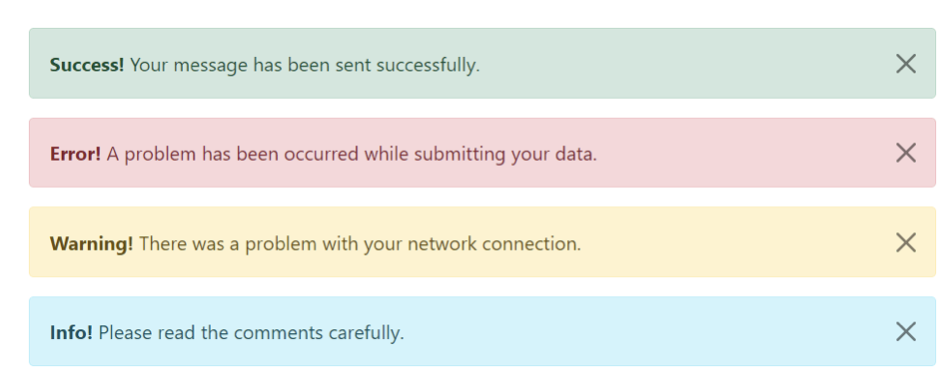

## Create an Alert Type component

It gets passed the following props

- message (string)
- type (can be 'info', 'warning', 'success', 'error')

I would like you to use Styled Props (https://styled-components.com/docs/basics) for the styling.

(This means that the type needs to affect the style)

## I would like to have this tested to 100% coverage

- Snapshot tests for each type of component
- Can I possibly make this one test?

## Extension - An onClose callback

- Can you make it so the Alert has an x in the correct location (as per the diagram)?
- Can you make it so an onClose event is called that is passed in the props when the X is clicked?
- Can you test the onClosed callback is working correctly?
