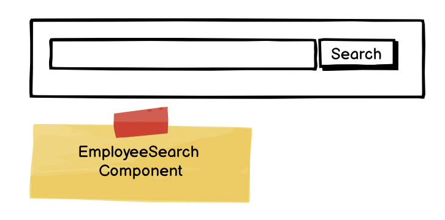
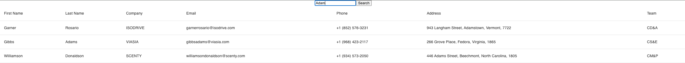

## Employee Search - My first page that calls an API

### First employee search exercise

There is an endpoint in the [`supporting-apis`](https://github.com/DuncanEdwards/supporting-apis) project called `GET /employees-api/employees` which returns employee data (you need to download and run this - details in the readme file).

1. Your first mission is to create an `Employee` type to model this data
2. Create an `EmployeesTable` component that can display a list of Employees (use MUI table - https://mui.com/material-ui/react-table/)
3. Create an employee page which calls the above API (using [Axios](https://www.npmjs.com/package/axios)) on page load and populates the `EmployeesTable`. You will need to utilize `useEffect`:[https://react.dev/reference/react/useEffect]
   and `useState`:[https://react.dev/reference/react/useState]

### Second Employee search exercise

I want to be able to search employees, but first I need an `EmployeeSearch`  component that will have a callback in its props every time a user initiates a search.

I want to be able to call this component like this:
`<EmployeeSearch onSearch={(searchTerm:string) => console.log(searchTerm)}/>`

And every time the user adds a string and presses "search", I want it to call the onSearch callback.

### Third Employee search exercise

Now I want you to wire it all together so we have a page like this:

Whenever the user changes the search text and clicks the button (or presses the `Enter` key), the search results update. This can be achieved with `useState` and by utilizing the `dependency array`[https://react.dev/reference/react/useEffect#passing-a-dependency-array] of useEffect. You should have a basic structure of:
`EmployeePage`, which contains an `EmployeeSearch` component and an `EmployeesTable`.

### Extension

What if the call took a long time to run? You can configure:\
[`supporting-apis`](https://github.com/DuncanEdwards/supporting-apis)
`.env` file to make the call return in 2000 milliseconds? How does your UI work.

Work our how to have some kind of "In Progress" display to show, in fact, I've given you one:\
[/public/loading-spinner.gif](/public/loading-spinner.gif)

## Testing the Employee Page

Testing each bit:

1. Test the `EmployeesTable` component using snapshot testing
2. Test the `EmployeeSearch` component
3. Test the `EmployeesPage` using https://www.npmjs.com/package/axios-mock-adapter to 100% coverage.
